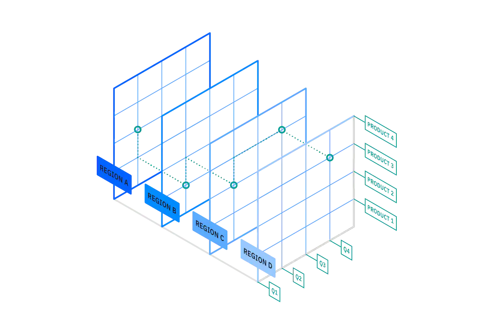

# Data Engineer Roadmap

* https://github.com/datastacktv/data-engineer-roadmap

* 전반적으로 쓰이는 것

  * CS fundamentals
  * Programming language
  * Testing
  * Network
  * Infrastructure as Code
  * CI/CD
  * Identity and access management
  * Data security & privacy

* Data engineer

  * Database fundamentals

    * Entity-Relationship model : entity(개체)들과 그들간의 relationship(관계)를 보여주는 개념적 모델

      * https://ko.wikipedia.org/wiki/%EA%B0%9C%EC%B2%B4-%EA%B4%80%EA%B3%84_%EB%AA%A8%EB%8D%B8

    * Relational model : E-R model을 컴퓨터에 적용시키기 위해 만든 논리적 모델. 데이터가 2차원 테이블에 담겨있다.

      * https://chartworld.tistory.com/6

    * SQL : 관계형 데이터베이스 관리 시스템(RDBMS)의 데이터를 관리하기 위해 설계된 특수 목적의 프로그래밍 언어. 자료검색 및 관리, 데이터베이스 스키마 생성과 수정, 데이터베이스 객체 접근 조정 관리.

      * https://ko.wikipedia.org/wiki/SQL

    * Normalization, Denormalization : 관계형 데이터베이스의 설계에서 중복을 최소화하게 데이터를 구조화하는 프로세스를 정규화라고 한다. 데이터를 정규화하면 하나의 테이블에서의 데이터 삽입, 삭제, 변경이 정의된 관계들로 인해 데이터베이스의 나머지 부분들로 전파된다. 보통 제 3정규화(3NF)되면 정규화되었다고 한다. 하지만 성능상의 이유로, 예를 들어 데이터 웨어하우스 디자인을 위해선 비정규화된 디자인을 추천한다.

      * https://ko.wikipedia.org/wiki/%EB%8D%B0%EC%9D%B4%ED%84%B0%EB%B2%A0%EC%9D%B4%EC%8A%A4_%EC%A0%95%EA%B7%9C%ED%99%94

    * ACID transactions : 데이터베이스 트랜잭션(데이터에 대한 하나의 논리적 실행단계)이 안전하게 수행된다는 것을 보장하기 위한 성질을 가리키는 약어. 원자성, 일관성, 독립성, 지속성을 의미.

      * https://ko.wikipedia.org/wiki/ACID

    * PACELC

      * CAP에서는 정상상황일 때의 분산 시스템 동작을 설명하지 못하기 때문에 새로 등장한 분산시스템에서 일관성과 가용성의 관계를 적은 이론
      * P(네트워크 파티션 장애) 상황에서 A(가용성)와 C(일관성)의 상충 관계, E(else, 정상) 상황에서 L(지연 시간)과 C(일관성)의 상충 관계를 설명
      * 완벽한 CA 또는 CP 시스템은 실효성이 없다
        * P(partition) : 네트워크 파티션 장애
        * A(availability) : 모든 노드가 어떤 상황이던 간에 시스템이 응답(성공 또는 실패여부)할 수 있는것
        * C(consistency) : 모든 노드가 같은 순간에 같은 데이터를 보기 위해 하나의 트랜젝션이 다른 모든 노드에 복제된 후에 완료되는 것
        * L(lagency) : 응답하는데 걸리는 시간
        * https://ko.wikipedia.org/wiki/CAP_%EC%A0%95%EB%A6%AC
        * http://eincs.com/2013/07/misleading-and-truth-of-cap-theorem/
        * http://happinessoncode.com/2017/07/29/cap-theorem-and-pacelc-theorem/

    * OLTP vs OLAP

      * OLAP(Online Analytical Processing) : 복잡한 판단을 하기 위해 다차원 분석을 빠르게 해주는 것
      * OLAP cube 예시) sales data를 region, quarter, product에 따라 보여줌

      

      * OLTP(Online Transaction Processing) : real time으로 수많은 transaction을 처리해주는 것

      * OLTP로 데이터를 수집한 다음 OLAP에게 데이터를 제공하는 형식으로 많이 쓰인다.

        | 속성       | OLAP                                                         | OLTP                                                         |
        | ---------- | ------------------------------------------------------------ | ------------------------------------------------------------ |
        | 목적       | 복잡한 분석으로 사업결정하기 위해서 하나의 쿼리가 많은 레코드를 다룬다 | 간단한 update, insertion, deletion쿼리들이 적은 레코드를 다룬다 |
        | 데이터소스 | 여러 OLTP 데이터베이스나 data warehouse                      | 전통적인 DBMS                                                |
        | 처리시간   | OLTP보단 느리고, read에 특화되어 있다                        | 빠르다                                                       |
        | 가용성     | 현재 데이터를 수정하지 않으므로 백업을 적게한다              | 데이터를 수시소 바꾸어 무결성을 유지하기 위해서 백업을 자주 해야한다 |

      * https://www.ibm.com/cloud/blog/olap-vs-oltp

    * Horizontal vs Vertical scaling

      * Horizontal Scaling(scaling out) : 자원을 증가시키기 위해 기기 개수 증가

      * Vertical Scaling(scaling up) : 자원을 증가시키기 위해 현재 기기에 cpu, ram등의 성능 증가

        | 속성               | Horizontal Scaling                                      | Vertical Scaling                                             |
        | ------------------ | ------------------------------------------------------- | ------------------------------------------------------------ |
        | 데이터 위치        | 각 노드들은 데이터의 일부만                             | 단일 노드에 모든 데이터                                      |
        | 성능               | 짧은 시간에 쉽게 무한대로 늘릴 수 있다                  | 같은 기기에서 작업해야하기 때문에 scaling 하기 쉽지 않고 늘릴 수 있는 한계가 있다 |
        | 병행수행방법       | Master/Worker, Tuple Spaces, Blackboard, MapReduce      | Multi threading, in process message passing                  |
        | 메시지 교환        | 주소부족, 여러개의 복사본을 가져야 해서 복잡하고 비싸다 | Multi threading의 경우 공유 주소 공간을 통해 pass by reference가 가능 |
        | DB 종류            | Cassandra, MongoDB, Google Cloud Spanner                | MySQL, Amazon RDS                                            |
        | 다중화(Redundancy) | 시스템 일부에 장애가 생겨도 전체의 기능 유지가능        | 시스템 일부에 장애가 생기면 전체가 중단한다                  |

      * https://www.section.io/blog/scaling-horizontally-vs-vertically/

    * Dimensional modeling

      * 데이터웨어 하우스 디자인
      * 사실(측정값, 일반적으로 집계할 수 있는 숫자 값, 판매금액 등), 차원(컨텍스트, 사실을 정의하는 계층, 타임 스탬프, 제품, 레지스터 번호, 상점 번호 등) 개념 사용
      * 장점
        * 이해도 : 정규화된 모델에 비해 이해하기 쉽고 직관적
        * 쿼리성능 : 비정규화 되고 데이터 쿼리에 최적화
        * 확장성 : 예상치 못한 새로운 데이터를 쉽게 수용 가능

  * Relational databases & Non-relational databases

    * MySQL : 

  * Data warehouses

    * 

  * Object storage

  * Cluster computing fundamentals

  * Data processing

  * Messaging

  * Workflow scheduling

  * Monitoring data pipelines

* Data scientist, Data analyst, Machine Learning engineer

  * Visualize data
  * Machine Learning fundamentals
  * Machine Learning Ops