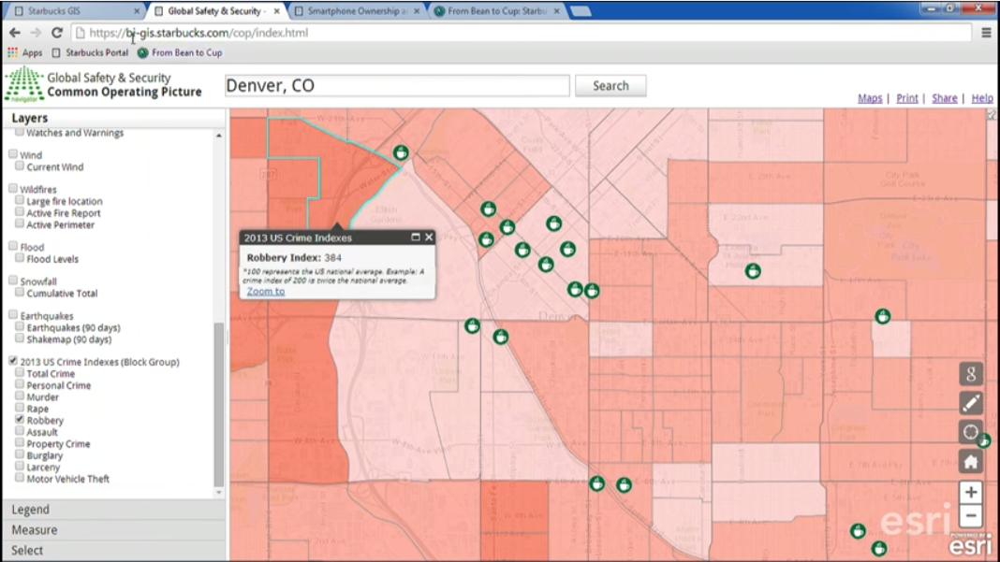
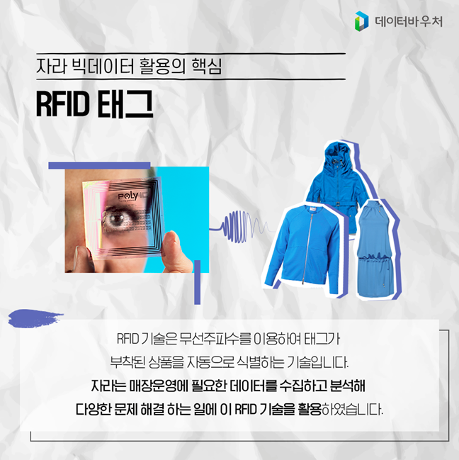
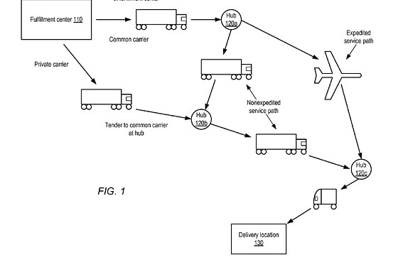

# 마케팅 빅데이터 활용 사례

- ### 스타벅스

- ### ZARA(자라)

- ### 아마존

# 스타벅스의 빅데이터 마케팅

- ### 빅데이터를 이용한 위치 분석

https://youtu.be/ATmq7-WxYdo ``starbucks GIS 960``

커피 구매 패턴과 점포 위치 등 데이터를 엔터프라이즈 데이터 웨어하우스와 통합시켜 수백만개의 레코드와 함께 매일 업데이트 합니다. 그리고 이를 **마케팅 전략에 활용**하는데, 커피 소비량이 많은 지역을 오버레이해 특정 프로모션에 적합한 지역을 찾거나 기상 데이터를 활용해 지역에 맞는 음료를 미리 준비합니다. 예를 들어 다음주 부산이 매우 더울 것으로 예상된다면, 이 지역에 맞는 프로모션을 지오디자인해 고객들이 원할 프라푸치노를 일주일 전에 준비할 수 있습니다.  

이 밖에도 **주요 행사가 매장에 미치는 영향도 분석**할 수 있습니다. 예를 들어 어느 지역에 퍼레이드, 불꽃놀이 같은 큰 행사가 있어 만 명이 넘는 사람들이 참가한다면, 스타벅스는 미리 스텝 충원과 재고 관리를 통해 고객에게 최상의 경험을 제공합니다.

# ZARA(자라)의 빅데이터 마케팅

- ### 빅데이터를 이용한 재고관리

데이터는 POS 기기, 온라인 판매, 소비자 설문조사, PDA 기기, 옷에 부착된 RFID 등을 통해 수집된다. 매장 직원들은 매장에 투입되기 전에 PDA 기기를 활용하여 단추, 지퍼, 색상, 재단 등 옷의 세부 사항에 대한 소비자의 선호를 기록하도록 훈련받는다. 직원들이 밤마다 PDA에 고객 선호에 대한 피드백을 PDA에 입력하면, 지역 매니저는 자신이 담당하는 지역의 고객 선호 자료를 따로 분리한다. 자라는 판매하는 모든 옷에 RFID 태그를 부착한다.

 RFID(Radio Frequenct Identification) 는 극소형 칩에 상품정보를 저장하고 안테나를 달아 무선으로 데이터를 송신하는 장치를 말한다. 옷에 부착된 RFID 태그를 통해 재고 상태를 손쉽게 파악할 수 있을 뿐만 아니라 어떤 옷들이 드레스룸에서 자주 들락날락 하는지, 즉 소비자의 선호도 파악할 수 있다. 또한 자라는 인스타그램, 설문조사, SNS 등에서 데이터를 수집한 후, 자라 고객들의 패션 감각에 대한 정보를 각 매장에 전달한다. 

그 후, 위에서 언급된 모든 데이터들을 스페인 Arteixo에 위치한 자라의 데이터에 합산시킨다. 이 데이터 센터에서는 24시간 동안 분석 전문가들이 일하며 데이터를 처리하여 새로운 디자인을 출시하고, 매장으로 2주 안에 배송시키는 일이 이루어진다. 자라는 매주 그들이 판매하는 각각의 옷들에 대한 재고 예측을 실시하며, 모두 판매된 옷들에 한해서는 소량으로 재생산한다. 자라는 위에서 언급된 데이터들을 바탕으로 손님들에 대해 잘 알고 있기 때문에, 어떤 문제가 생겼을 때 다른 경쟁사들보다 빠르게 대응할 수 있다. 패스트 패션 브랜드인 만큼 재빠른 **트렌드 조사 및 확보와 물류시스템에도 4차 산업기술을 활용**하고 있는 것이다 .

# 아마존의 빅데이터 마케팅

- ### 예측배송 시스템

